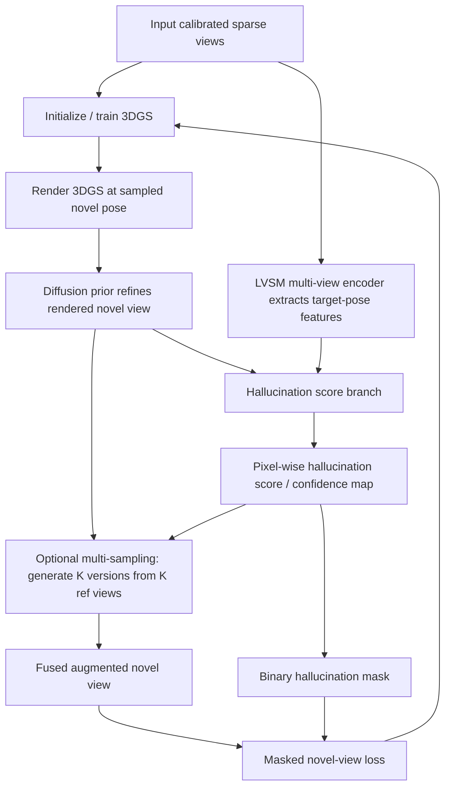

# HAD: Hallucination-Aware Diffusion Priors for 3D Reconstruction — Paper-to-Codebase Report

**Paper:** *HAD: Hallucination-Aware Diffusion Priors for 3D Reconstruction*  
**Authors:** Xi Liu, Weiwei Sun, Zhou Ren, Chris Broaddus, Siyu Huang, Laurent Guigues  
**Venue:** CVPR 2026  
**Primary task:** sparse-view 3D reconstruction / novel view synthesis using 3D Gaussian Splatting plus diffusion-generated novel-view supervision  
**Core codebase inspected:** `xiliu8006/HAD` official GitHub repository  
**Supplementary material:** [CVPR 2026 supplemental PDF](https://openaccess.thecvf.com/content/CVPR2026/supplemental/Liu_HAD_Hallucination-Aware_Diffusion_CVPR_2026_supplemental.pdf)  
**Purpose of this report:** Use this as context in an AI-powered IDE so the IDE can connect paper concepts (main paper + supplement) to the implementation: files, functions, expected data flow, config flags, and likely search targets.

---

## 1. One-paragraph thesis

HAD starts from a practical failure mode of diffusion-assisted 3D reconstruction: diffusion priors can make sparse-view 3DGS renderings look more realistic, but they can also add visual content that was never observed in the input views. The paper calls these hallucinated regions “aliens.” Instead of trying to make the diffusion model perfectly faithful, HAD predicts a **pixel-wise hallucination score map** for each diffusion-augmented novel view and uses that map to prevent unreliable pixels from supervising the 3DGS model. It also generates multiple diffusion refinements of the same novel view conditioned on different reference input views, then fuses them by selecting the pixel with the lowest predicted hallucination score (equivalently, highest predicted confidence in the released code).

---

## 2. The problem the paper is solving

Sparse-view 3D reconstruction has a data scarcity problem. A 3DGS model trained from only a few posed images may render blurry, incomplete, or artifact-heavy novel views. Recent systems use diffusion priors to “fix” these novel views and use them as extra supervision. The problem is that diffusion models are generative: they can make plausible details that are inconsistent with the scene. If those fake pixels supervise the 3D model, the final 3D reconstruction may become visually appealing but less faithful to the original multi-view observations.

The paper’s key framing:

- **Diffusion prior = good photorealism, risky fidelity.**
- **Feedforward NVS backbone = better multi-view consistency, but often blurrier.**
- **HAD = use a multi-view NVS backbone to judge which diffusion pixels are trustworthy.**

### 2.1 Supplementary analysis: where hallucinations come from (Supp. §7)

The supplement analyzes hallucination across **two diffusion paradigms**. Neither mode is implemented as a separate module in the released repo, but this framing explains *why* the scorer and masking matter.

| Paradigm | Examples (paper) | Failure mode | Relevance to HAD code |
|---|---|---|---|
| **Diffusion-assisted NVS with explicit 3DGS** | Difix3D, GenFusion, 3DGS-enhancer | Imperfect 3D geometry (floaters, distortions in sparse/unseen regions) → diffusion “corrects” renderings with semantically plausible but wrong content borrowed from reference views | This is exactly the Difix3D + 3DGS loop in `fix()`: render → DiFix refine → score → mask |
| **NVS directly via diffusion** | SVC | No explicit 3D representation → photorealistic but geometrically inconsistent structures across views | Scorer generalizes to SVC/GenFusion **without fine-tuning** (Supp. §9); **not** reproduced in this repo |

**Supp. Fig. 4 insight (iterative amplification):** In diffusion-assisted 3DGS, small initial artifacts (floaters, mild distortions) can be **progressively amplified** across iterative refinement—not introduced all at once. In code, this motivates periodic `fix_steps` that re-render, re-refine, and re-score as 3DGS evolves.

---

## 3. High-level method pipeline



In words:

1. Load a sparse set of calibrated input images.
2. Train a 3DGS model (released code uses **MCMC** densification by default).
3. At scheduled intervals, sample novel target poses.
4. Render the current 3DGS model at those poses.
5. Pass the rendered image through a pretrained diffusion prior, conditioned on a nearby/reference input view.
6. Predict a hallucination score map for the diffusion output using an LVSM-based multi-view encoder and score branch.
7. Convert score map to a mask (threshold on confidence in released code).
8. Use only reliable pixels from the diffusion-augmented view as supervision for 3DGS.
9. Optionally run the diffusion refinement multiple times with different reference views and fuse pixels by lowest hallucination score / highest confidence.

---

## 4. Core paper equations and what they mean in code

### 4.1 Input-view 3DGS loss

The paper keeps the standard 3DGS-style RGB reconstruction loss on observed input views:

```text
L_input = 0.8 * L1(R_phi(c), i) + 0.2 * L_D-SSIM(R_phi(c), i)
```

**Code concept:** regular 3DGS training loss on real training views when `is_novel_data=False`. Search for `ssim_lambda`, `fused_ssim`, `loss`, `colors`, `pixels`, and `is_novel_data` in `examples/gsplat/train_dreamaware3d.py`.

Released asymmetry (not in main paper equation): input views are scaled by **1.5×**, novel augmented views by **`novel_data_lambda=0.3`**.

### 4.2 Diffusion refinement

The paper defines a diffusion-generated novel image:

```text
i_G_tilde = G(R_phi(c_tilde) | i_ref)
```

Where:

- `R_phi(c_tilde)` = current 3DGS rendering at a sampled novel pose.
- `i_ref` = input reference view used as conditioning.
- `G` = pretrained diffusion prior, based on Difix3D.

**Code concept:** the released training script initializes a DiFix pipeline with:

```python
self.difix = DifixPipeline.from_pretrained("nvidia/difix_ref", trust_remote_code=True)
```

DiFix call site (render = `image`, nearest input = `ref_image`):

```python
self.difix(
    prompt="remove degradation",
    image=image,              # 3DGS render at novel pose
    ref_image=ref_image,      # nearest training input view
    num_inference_steps=1,
    timesteps=[199],
    guidance_scale=0.0,
)
```

Likely code locations:

- `src/pipeline_difix.py` — diffusion pipeline wrapper (`ref_image` conditioning at line ~1017).
- `examples/gsplat/train_dreamaware3d.py` — `Runner.fix()` instantiates and calls DiFix during scheduled augmentation.

### 4.3 Hallucination score estimation

The paper predicts a score map:

```text
F_c_tilde = V(P | c_tilde)
s = S_theta(i_G_tilde | R_phi(c_tilde), F_c_tilde)
```

Where:

- `V` = pretrained LVSM multi-view feature backbone (**frozen** at HAD inference per Supp. §8 / Fig. 6).
- `S_theta` = score estimation branch — Supp. describes a **three-layer U-Net**; code implements `UNetWithConfidence` (3 encoder/decoder levels + residual output blocks).
- `s` = per-pixel hallucination probability / score (released code stores **confidence** = reliability, i.e. inverse of hallucination).

Training target for the score network (paper + supplement):

```text
GT score = MAE(i_G_tilde, i_GT)
Loss_score = L2(predicted_score, GT_score)
```

**Supp. §8 training-data curation (not shipped in repo, but defines what the checkpoint learned):**

1. For each scene, run the **Difix3D 9-view pipeline** to build a 3DGS model.
2. Render all views **not** in the 9 input views → `I_3DGS`.
3. Apply Difix3D diffusion refinement to each rendering → `I_difix`.
4. Pair with ground truth `I_GT` and camera pose → training triplets `(I_GT, I_difix, I_3DGS)`.
5. For each target pose, select the **3 nearest input views** (from the 9 training views) by camera proximity.
6. Encode input views with frozen LVSM encoder → multi-view features `F`.
7. Concatenate `F`, `I_difix`, and optionally `I_3DGS`; feed to learnable U-Net → predict score map matching MAE(`I_difix`, `I_GT`).

**Code mapping for Supp. Fig. 6:**

| Supplement symbol | Meaning | Code artifact |
|---|---|---|
| `V` (frozen encoder) | LVSM transformer backbone on input views + target pose | `Images2LatentScene.forward_direct()`, `self.transformer_blocks`, `@torch.no_grad()` in `fix()` |
| Multi-view features `F` | Target-pose features from encoder | `multi_feature_adpator` → 6-channel map |
| `~i_G` / `I_difix` | Diffusion-enhanced target view | `input_dict["difix3D_image"]` |
| `R` / `I_3DGS` (optional) | 3DGS render before diffusion | `input_dict["pred_image"]` |
| `S` (learnable U-Net) | Hallucination score head | `self.difix3d_conf_decoder` = `UNetWithConfidence(in_channels=12)` |
| Concat before U-Net | 6 + 3 + 3 channels | `torch.cat([multi_view_features, difix3D_images, pred_images], dim=1)` |
| Output `s` | Hallucination / confidence map | `result["difix3D_conf"]` (Sigmoid → higher = more reliable) |
| 3 nearest input views | Training & inference context | `input_view_num=3`, `num_input_views: 3` in yaml, `find_nearest_assignments(..., top=3)` |

**Pseudo-GT in bundled loss code** (`LVSM/model/loss.py`, `forward_withconf`): at train time the repo uses `1 − L1(difix3d_image, target)` as a per-pixel proxy for reliability, trained with L1 against `difix3D_conf`. Related to but not identical to the paper’s MAE formulation.

Likely code locations:

- `LVSM/model/LVSM_scene_decoder_only_withconf_adaptor.py` — full architecture.
- `LVSM/configs/LVSM_scene_decoder_only_conf_512.yaml` — runtime config (`num_input_views: 3`, 512-token resolution).
- `scripts/run_lvsm_hallucination.py` — standalone scoring script.
- `scripts/run_hallucination_scoring.py` — thin wrapper around `run_lvsm_hallucination.py`.

**Important naming issue:** the paper uses **hallucination score** (higher = more hallucinated). The released code uses `confidence` / `difix3D_conf` (higher = more reliable). Fusion uses **argmax confidence** ≡ **argmin hallucination score**.

**Not in released repo:** scripts to curate scorer training triplets or fine-tune the scorer. Only inference + a downloadable checkpoint.

### 4.4 Masked novel-view supervision

The paper masks unreliable pixels in the novel-view supervision term:

```text
L_novel = L1(not m * R_phi(c_tilde), not m * i_tilde)
        + L_D-SSIM(not m * R_phi(c_tilde), not m * i_tilde)
```

Where:

- `m` = binary hallucination mask.
- `not m` = reliable-pixel mask.
- `i_tilde` = HAD-refined/fused augmented image.

**Code concept:** masking happens **after** rasterization by zeroing unreliable pixels in both render and target, not inside `rasterize_splats`:

```python
if is_novel_data and uncertainty_masks is not None:
    mask = (uncertainty_masks > cfg.uncertainty_mask_threshold).float()
    colors = colors * mask
    pixels = pixels * mask
```

Default `uncertainty_mask_threshold=0.9`; logged in each run's `cfg.yml`. Override via `--uncertainty_mask_threshold` or `UNCERTAINTY_MASK_THRESHOLD` env in launch scripts.

Mask PNGs are written in `fix()` from merged confidence and loaded via `parser.uncertainty_mask_paths`. Config flags: `use_conf`, `use_lvsm`, `view_fusion`, `num_sparse_view`, `target_sample_step`, `novel_data_lambda`, `uncertainty_mask_threshold`.

### 4.5 Multi-sampling / fusion

The paper creates `K` diffusion outputs for the same target pose by conditioning on different input reference views:

```text
{(i_G_tilde^k, s^k) | k = 1..K}
```

Then fuses per pixel by choosing the candidate with the lowest hallucination score:

```text
i_tilde[p] = i_G_tilde^{k*}[p]
k* = argmin_k s^k[p]
```

**Code concept:** `view_fusion` controls `K`. Default launchers: `VIEW_FUSION=3` (DL3DV), `VIEW_FUSION=1` (Mip-NeRF 360).

Fusion implementation uses **pixel-wise max confidence**, not `torch.argmin`:

```python
merged_conf, max_conf_indices = torch.max(confidence_maps, dim=0)
merged_image = torch.gather(images, 0, max_conf_indices)
```

Search targets: `view_fusion`, `merge_by_confidence`, `ref_indices[:self.cfg.view_fusion]`, `difix3D_conf`.

Supp. §10.2 / main-paper ablation: hard argmin selection outperforms weighted averaging; code also defines unused `merge_by_confidence_weighted_avg` and `merge_by_confidence_mean` for experimentation.

---

## 5. Paper-to-code mapping table

| Paper / supplement concept | Meaning | Likely code artifact / search target |
|---|---|---|
| 3DGS representation | Gaussian means, scales, rotations/quaternions, opacity, SH colors | `create_splats_with_optimizers`, `self.splats`, `rasterization` |
| MCMC 3DGS (release default) | Markov-chain densification strategy used in all launchers | `train_dreamaware3d.py mcmc`, `MCMCStrategy` |
| Render function `R_phi(c)` | Render current 3DGS from a camera pose | `rasterize_splats`, `render_traj`, `gsplat.rendering.rasterization` |
| Input-view loss | Supervise on real sparse input views | `ssim_lambda`, `fused_ssim`, `is_novel_data=False`, loss × 1.5 |
| Novel target pose sampling | Views for diffusion augmentation (not trajectory interpolation) | `Dataset(..., split="target")`, `target_sample_step`, `colmap.py` target indices |
| Nearest reference views | K conditioning views for multi-sampling | `CameraPoseInterpolator.find_nearest_assignments`, `top_N_ref_index`, `input_view_num=3` |
| Diffusion prior `G` | Refine rendered novel views | `src/pipeline_difix.py`, `self.difix`, `ref_image=` |
| LVSM encoder `V` (frozen) | Multi-view features at target pose | `LVSM/`, `model_lvsm`, `forward_direct`, `@torch.no_grad` in `fix()` |
| Multi-view features `F` | 6-channel target-pose feature map | `multi_feature_adpator` |
| Score branch `S_theta` | U-Net hallucination / confidence head | `UNetWithConfidence`, `difix3d_conf_decoder`, `difix3D_conf` |
| `I_3DGS` optional input | Pre-diffusion 3DGS render | `pred_image` in input dict |
| Hallucination mask `m` | Mask unreliable pixels | `use_conf`, `uncertainty_mask`, `uncertainty_mask_threshold` (default 0.9) |
| Multi-sampling `K` | K reference-conditioned DiFix outputs | `view_fusion`, `VIEW_FUSION` |
| Fusion argmin / argmax | Pick best pixel across K candidates | `merge_by_confidence` → `torch.max` on `difix3D_conf` |
| Single-phase training | Input + augmented views from early training | `fix_steps`, `novelloaders`, ~70/30 input/novel batch mix |
| Evaluation | PSNR, SSIM, LPIPS | `PeakSignalNoiseRatio`, `StructuralSimilarityIndexMeasure`, `LearnedPerceptualImagePatchSimilarity`, `summarize_had_eval_results.py` |
| Scorer training triplets (Supp. §8) | `(I_GT, I_difix, I_3DGS)` curation | **Not in repo** — defines checkpoint, not runtime |
| GenFusion / SVC integration (Supp. §9) | Scorer on other diffusion paradigms | **Not in repo** — paper-only generalization demos |

---

## 6. Official repository structure and how it maps to the paper

From the official README layout:

```text
configs/                     Evaluation scene lists.
examples/gsplat/             Training code, COLMAP dataset loader, and gsplat helpers.
examples/gsplat/pycolmap/    Lightweight COLMAP binary parser used by the dataset loader.
LVSM/                        Hallucination scoring network built on LVSM codebase.
scripts/                     Result summarization utilities and hallucination scoring runner.
slurm/                       Single-GPU shard launchers.
src/                         DiFix pipeline wrapper.
```

Practical interpretation:

- **Start with `examples/gsplat/train_dreamaware3d.py`** if you want the full 3DGS training loop.
- **Start with `scripts/run_lvsm_hallucination.py`** if you only want to understand scoring inputs/outputs.
- **Start with `src/pipeline_difix.py`** if you want the diffusion-prior side.
- **Start with `LVSM/model/LVSM_scene_decoder_only_withconf_adaptor.py`** if you want Supp. Fig. 6 architecture.
- **Start with `run_train_scene.sh` and `run_had_eval_dataset.sh`** if you want to reproduce paper-style runs.

**Legacy naming:** shell scripts and output dirs still use `DreamAware3D` / `dreamaware3d_lvsm_view9_fusion3` prefixes from the internal project name.

---

## 7. Key code switches / config fields to inspect

In `examples/gsplat/train_dreamaware3d.py`, the config includes several flags that correspond directly to paper concepts:

```text
max_steps:           default 20_000 in released script (paper reports 30k)
fix_steps:           scheduled steps where augmentation/fixing is run (extends to 58k in list, but only steps < max_steps execute)
num_sparse_view:     sparse input view count, default 9
target_sample_step:  subsample rate for target/novel poses (2 DL3DV, 1 Mip-NeRF 360 in launchers)
view_fusion:         K — number of diffusion versions / reference views for fusion
use_conf:            whether confidence/hallucination masking is enabled
use_lvsm:            whether LVSM-based scoring is enabled (vs oracle `use_pefect_conf`)
lvsm_mode:           alternate LVSM operation mode (image-level ref selection)
novel_data_lambda:   weight multiplier for novel augmented data (default 0.3)
uncertainty_mask_threshold: keep novel pixels where confidence > threshold (default 0.9)
split_json:          sparse-view train/test split file (Mip-NeRF 360 Reconfusion splits)
input_view_num:      hardcoded 3 — matches Supp. §8 “three nearest input views”
```

Be careful: the paper reports `lambda_input = lambda_novel = 1`, while the released training code uses `novel_data_lambda = 0.3` for novel views and **1.5×** for input views. Trace `is_novel_data` in the training loop to see exact scaling.

**3DGS learning rates** (paper-aligned, in `create_splats_with_optimizers`): means `1.6e-4/2 * scene_scale`, scales `5e-3`, quats `1e-3`, opacities `5e-2`, SH `2.5e-3/5` and `2.5e-3/20/5`.

---

## 8. Standalone hallucination scoring interface

The official README describes a standalone scoring command:

```bash
python scripts/run_hallucination_scoring.py \
  --input /path/to/hallucination_scoring_input.npz \
  --output-dir /path/to/hallucination_scoring_outputs
```

The `.npz` is expected to contain:

```text
ref_images
ref_c2w
ref_intrinsics
target_c2w
target_intrinsics
hallucinated_images
pred_images            # optional; defaults to hallucinated_images — maps to I_3DGS in Supp. §8
```

The script computes rays from poses and intrinsics, loads the LVSM model, calls `model.forward_direct(...)`, and writes outputs such as:

```text
lvsm_render_XXXX.png           # LVSM NVS render (result["render"])
predicted_hallucination_XXXX.png  # difix3D_render head output (refined image, not the score map)
confidence_XXXX.png            # difix3D_conf (primary HAD reliability map)
lvsm_confidence_XXXX.png       # conf (LVSM render confidence, auxiliary)
confidence_XXXX.npy
lvsm_confidence_XXXX.npy
```

Default resolution: **640×360** (override with `--height` / `--width`). Training-time `fix()` uses **960×536** for LVSM inference.

This is the easiest entry point for understanding the scoring model without reading the entire 3DGS training loop.

---

## 9. What to ask an AI IDE inside the codebase

Use this prompt first:

```text
I am reading the HAD CVPR 2026 paper and supplemental material. Map the pipeline to this repository.
Focus on: 3DGS render R_phi(c), DiFix diffusion prior G, frozen LVSM encoder V, U-Net score branch S_theta,
pred_image (I_3DGS), difix3D_image (I_difix), confidence mask construction, view_fusion multi-sampling,
and masked novel-view loss.
Use the report file as the conceptual guide and point me to exact functions/classes/line ranges.
```

Then use these targeted prompts:

```text
Find where DifixPipeline is called during training. Explain what image is passed as the rendered novel view and what image/view is used as the reference condition.
```

```text
Trace view_fusion and merge_by_confidence. Does it implement the paper's multi-sampling K? Confirm fusion uses max confidence, not argmin on score.
```

```text
Trace use_conf and difix3D_conf. Where is confidence thresholded at 0.9 and converted to uncertainty_mask PNGs?
```

```text
Map Supp. Fig. 6 to LVSM_scene_decoder_only_withconf_adaptor.py: frozen encoder, multi_feature_adpator, pred_image, difix3D_image, difix3d_conf_decoder.
```

```text
Compare released hyperparameters with paper + supplement: max_steps, MCMC vs default 3DGS, view_fusion, 3 input views, confidence threshold, training resolution 960x536 vs scoring 640x360.
```

```text
What supplemental experiments (GenFusion, SVC) are NOT implemented in this repository?
```

---

## 10. Implementation notes / pitfalls

### 10.1 Score vs confidence naming

The paper uses a hallucination score, where a larger value sounds like “more hallucinated.” The released code uses `confidence` names, where a larger value means “more reliable.” Verified end-to-end:

- `difix3D_conf` = Sigmoid output → [0, 1], higher = more reliable.
- Fusion: `torch.max` over candidate confidence maps.
- Training mask: keep pixels where confidence **> uncertainty_mask_threshold** (default 0.9).

### 10.2 Coordinate conventions

The standalone scoring script expects camera-to-world matrices and intrinsics. It rescales intrinsics when resizing images, preprocesses poses unless `--poses-preprocessed` is used, and computes rays for input and target views. Training `fix()` uses the same `preprocess_poses` logic.

### 10.3 Resolution mismatch

| Setting | Resolution |
|---|---|
| Paper / supplement (score training) | 960 × 540 |
| Training `fix()` LVSM inference | **960 × 536** |
| Standalone scoring default | **640 × 360** |
| Dataset loader | `data_factor=4` downsampled COLMAP images |

### 10.4 Hard-coded local paths

The release scripts contain hard-coded paths from the authors’ environment (`/home/xi9/code/DreamAware3D_open_source`, cluster data roots). Override:

```bash
PROJECT_ROOT
DATA_ROOT
OUTPUT_ROOT
LVSM_ROOT
LVSM_CKPT_PATH
MIPNERF_DATA_ROOT
SPLIT_JSON
```

### 10.5 Paper vs released-code hyperparameters

| Setting | Paper / supplement | Released defaults |
|---|---|---|
| 3DGS iterations | 30k (paper) | 20k (`MAX_STEPS=20000`) |
| Densification | MCMC comparisons in tables | **MCMC** in all launchers |
| Confidence threshold | Not always explicit in main text | `uncertainty_mask_threshold` default **0.9** (Config + `cfg.yml`) |
| Loss weights | λ_input = λ_novel = 1 | input ×1.5, novel ×0.3 |
| VIEW_FUSION | 3 (DL3DV ablations) | 3 DL3DV, 1 Mip-NeRF 360 |

### 10.6 What the supplement adds that is NOT in the codebase

- **Scorer training pipeline** (triplet curation, Supp. §8)
- **GenFusion + HAD** integration (Supp. §9.1, Tab. 8)
- **SVC / GenFusion hallucination visualization** without fine-tuning (Supp. §9.2, Figs. 8–9)
- **Additional qualitative figures** (Supp. §10.1, Figs. 10–12) — see [project website](https://xiliu8006.github.io/HAD-Project-website/) for videos

---

## 11. Experimental results to keep in mind

### 11.1 DL3DV sparse-view setting (main paper)

| Method | Type | PSNR ↑ | SSIM ↑ | LPIPS ↓ |
|---|---:|---:|---:|---:|
| Depthsplat | Feedforward | 18.324 | 0.640 | 0.378 |
| LVSM | Feedforward | 19.855 | 0.636 | 0.252 |
| Gsplat-3DGS | Optimization | 19.004 | 0.679 | 0.281 |
| Gsplat-MCMC | Optimization | 20.532 | 0.721 | 0.225 |
| Difix3D | Optimization | 21.355 | 0.734 | 0.199 |
| Ours* | Optimization | 21.983 | 0.755 | 0.195 |
| Ours | Optimization | 22.134 | 0.757 | 0.190 |

Interpretation: the improvement over Difix3D supports the paper’s claim that hallucination awareness is useful beyond simply using a diffusion prior.

### 11.2 Mip-NeRF 360 cross-domain setting (main paper)

| Method | Type | PSNR ↑ | SSIM ↑ | LPIPS ↓ |
|---|---:|---:|---:|---:|
| Gsplat-3DGS | Optimization | 15.748 | 0.424 | 0.431 |
| Gsplat-MCMC | Optimization | 17.102 | 0.454 | 0.385 |
| FSGS | Optimization | 17.940 | 0.492 | 0.468 |
| GenFusion | Optimization | 18.360 | 0.496 | 0.465 |
| Difix3D | Optimization | 18.001 | 0.475 | 0.350 |
| Ours | Optimization | 18.689 | 0.5094 | 0.334 |

Interpretation: the LVSM-based hallucination scorer generalizes beyond the DL3DV domain used to train it.

### 11.3 GenFusion + HAD (Supp. Tab. 8 — not in repo)

Same HAD checkpoint applied to GenFusion video diffusion **without fine-tuning** on DL3DV:

| Method | PSNR ↑ | SSIM ↑ | LPIPS ↓ |
|---|---:|---:|---:|
| GenFusion | 20.57 | 0.7396 | 0.2845 |
| GenFusion + HAD | 20.80 | 0.7415 | 0.2817 |

+0.23 PSNR from masking low-confidence pixels with the same strategy as Difix3D + HAD.

### 11.4 Scorer architecture ablations (Supp. Tab. 9 — score MAE)

| Variant | Score MAE ↓ |
|---|---:|
| Ours (w/o 3DGS input `I_3DGS`) | 0.044 |
| Ours (w/o pretrained encoder) | 0.054 |
| **Ours (full)** | **0.043** |

Code implication: `pred_image` (`I_3DGS`) is optional but included in the full model concat (12-channel U-Net input). Pretrained LVSM initialization is critical.

### 11.5 Scorer ablations on final 3D reconstruction (Supp. Tab. 10)

| Variant | PSNR ↑ | SSIM ↑ | LPIPS ↓ |
|---|---:|---:|---:|
| **Ours (full)** | **22.134** | **0.757** | **0.190** |
| W/o pretrain | 21.600 | 0.748 | 0.1974 |
| W/o 3DGS input | 21.960 | 0.755 | 0.1891 |

Removing pretrained encoder hurts most; removing `I_3DGS` input has minor impact on final NVS metrics.

### 11.6 Main-paper ablation highlights

| Ablation | Result |
|---|---|
| `Difix3D + HAD` improves over `Difix3D` | HAD’s mask/score matters. |
| `Difix3D + HAD + M.S.` improves further | multi-sampling helps. |
| 3 versions > 2 versions > 1 version | more reference-conditioned versions improve performance. |
| ArgMin fusion > weighted average | hard selection of lowest-score pixels worked better (Supp. confirms design). |
| Full scorer MAE = 0.043 vs 0.054 without pretrained encoder | pretrained multi-view encoder is essential (Supp. Tab. 9). |

---

## 12. Mental model for debugging the implementation

When inspecting the code, keep this invariant in mind:

```text
A pixel from a diffusion-generated image should only supervise 3DGS if the multi-view scorer thinks it is consistent with the input views.
```

So any correct implementation needs four things:

1. A rendered novel view from the current 3DGS (`pred_image` / render PNG).
2. A diffusion-refined version of that novel view (`difix3D_image` / DiFix output).
3. A score/confidence map telling which pixels are reliable (`difix3D_conf`).
4. A training loss that uses the reliable pixels and ignores or downweights the unreliable ones (`uncertainty_mask` gating).

If you can find these four pieces in the code, you have found the core of HAD.

**Supplement mental model:** hallucinations in diffusion-assisted 3DGS often **start as mild geometry errors** and get **amplified** by iterative diffusion refinement—so re-running `fix()` at multiple `fix_steps` as geometry improves is intentional, not redundant.

---

## 13. Supplementary material — section index

Quick map from supplement sections to this report and codebase:

| Supp. section | Topic | In codebase? |
|---|---|---|
| §7 | Hallucination analysis (3DGS-assisted vs direct diffusion) | Conceptual only — see §2.1 |
| §8 / Fig. 6 | Scorer architecture, training data curation, 3 nearest views | Architecture ✅; training curation ❌ |
| §9.1 / Tab. 8 | GenFusion + HAD | ❌ |
| §9.2 / Figs. 8–9 | SVC & GenFusion hallucination detection | ❌ (scorer checkpoint could be applied externally) |
| §10.1 / Figs. 10–12 | Extra qualitative results + videos | ❌ (project website) |
| §10.2 / Tabs. 9–10 | Scorer ablations (pretrain, I_3DGS input) | Architecture supports ablations; no ablation scripts shipped |

---

## 14. Source pointers

- Main paper PDF: https://openaccess.thecvf.com/content/CVPR2026/papers/Liu_HAD_Hallucination-Aware_Diffusion_Priors_for_3D_Reconstruction_CVPR_2026_paper.pdf
- **Supplementary PDF:** https://openaccess.thecvf.com/content/CVPR2026/supplemental/Liu_HAD_Hallucination-Aware_Diffusion_CVPR_2026_supplemental.pdf
- Project page (qualitative videos, Supp. Figs. 10–12): https://xiliu8006.github.io/HAD-Project-website/
- Official code: https://github.com/xiliu8006/HAD
- ArXiv: https://arxiv.org/abs/2605.16873
